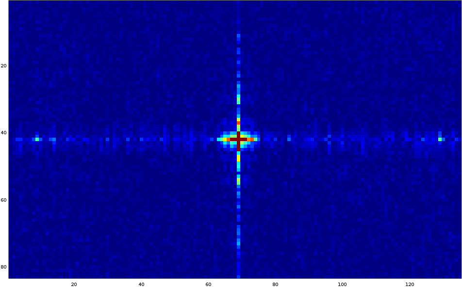
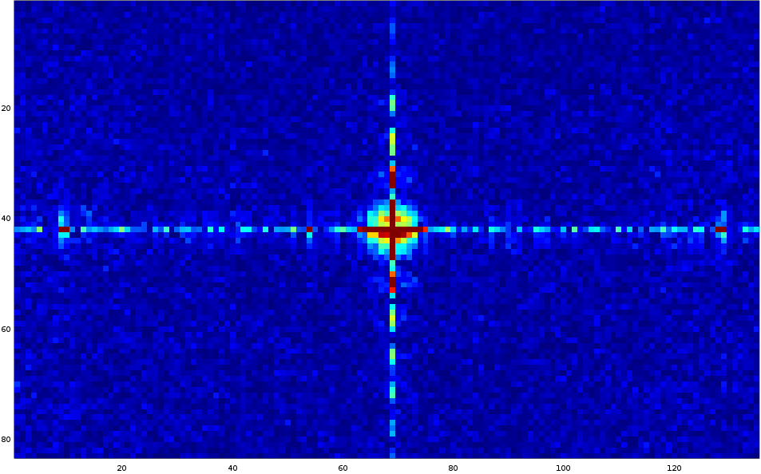

# Passive Radar @ Science Hack Day Berlin 2016

## Mission

Create a VR experience from passive radar signals.

## Project members

@teoguso- math maker

@meredityman- fearless cheerleader 

@sveinb- radio mercenary

@nolash- enigmatic VR prophet

@xmunoz- software wench

## Components

- documents: the scientific paper detailing the FFT algorithms needed for signal processing
- grc_examples: the GNURadio block descriptions
- data: the output from gnuradio, and the custom block used to produce that output
- output_processing: a grab bag of scripts written to try to make sense of the data
- unity: [unity game engine](https://unity3d.com/) tools

## Other Resources

- [Inspiration](http://hackaday.com/2015/06/05/building-your-own-sdr-based-passive-radar-on-a-shoestring/)
- [GNURadio bootable Ubuntu ISO](http://gnuradio.org/redmine/projects/gnuradio/wiki/GNURadioLiveDVD) to save our sanity and help us escape dependency purgatory
- [Multi-RTL GNU Radio Block](https://github.com/ptrkrysik/multi-rtl)
- 2 TV tuners (Cinergy TStick+) similar to [these](http://www.terratec.net/details.php?artnr=193534)
- [USB Hub 7 Port](https://www.sitecom.com/en/usb-hub-7-port/cn-061/p/13)
- Cables, duct tape, oscilloscope, solder, elbow grease

## Output

**X axis:** *Range*. Delay measured in samples. Total distance of transmitter to target plus target to recevier minus transmitter to receiver.
**Y axis:** *Doppler shift*. 

The "crosshair" shows the *auto-correlation* (horizontal) and the *power spectrum* (vertical) of the TV signal .

Radar objects would have been expected to appear as lightly blue to green colored objects in the quadrants. However, in the time we had at disposal after the system was functional, we were not able to record any further observations.

